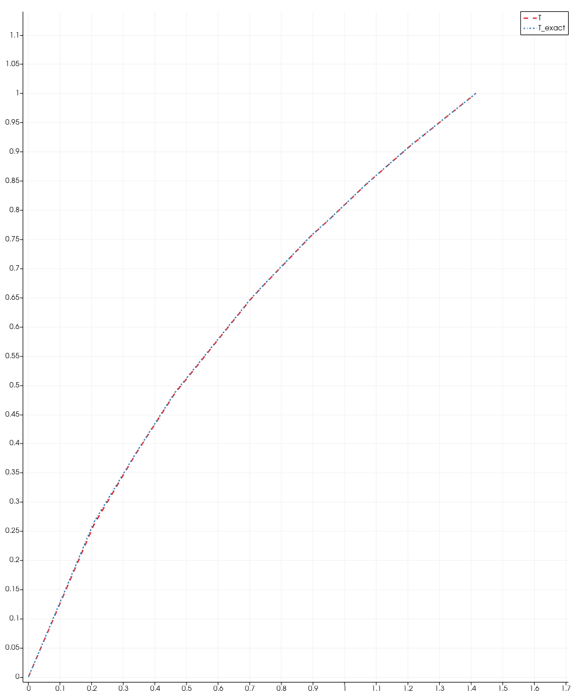

# Solving a nonlinear Fourier equation with FEM and Arcane #


Here a nonlinear Fourier equation, that governs steady state heat conduction is solved using FEM in Arcane. The code here is a simple 2D unstructured mesh Galerkin FEM solver.

## Theory of nonlinear heat conduction ##

#### Problem description ####

The steady state 2D nonlinear heat conduction equation is solved for a closed meshed domain $\Omega^h$ in order to know the temperature $T(x,y)$ within the domain. The equation reads

$$\frac{\partial}{\partial x}\left(\lambda(T) \frac{\partial T}{\partial x} \right) + \frac{\partial}{\partial y}\left(\lambda(T) \frac{\partial T}{\partial y} \right)+ \dot{\mathcal{Q}} = 0  \quad \forall (x,y)\in\Omega^h $$

or in a more compact form

$$\nabla(\lambda(T) \nabla T) + \dot{\mathcal{Q}} = 0 \quad \forall (x,y)\in\Omega^h.$$

Here, $\lambda(T)$ is the temperature dependent thermal conductivity of the material and $\dot{\mathcal{Q}}$ is the heat generation source.
The nonlinearity in the above equation is due to the coefficient $\lambda(T)$. 

To complete the problem description, two first type (Dirichlet) boundary conditions are applied to this problem:

- $T = 0.0 &deg C \quad \forall(x,y)\in\partial\Omega^h_{\text{left}}\subset\partial \Omega^h,$ and

- $T = 1.0 &deg C \quad \forall(x,y)\in\partial\Omega^h_{\text{right}}\subset\partial \Omega^h,$ 

in addition, all other boundaries $\partial \Omega^h_{N} = \partial \Omega^h \setminus (\partial\Omega^h_{\text{left}} \cup \partial\Omega^h_{\text{right}})$ are exposed to second type (Neumann) boundary condition:
- $\lambda(T) \nabla T \cdot \mathbf{n}|_{\partial \Omega^h_{N} } = \overline{q} \cdot \mathbf{n}|_{\partial \Omega^h_{N} } = 0$

Finally, the heat-source term is set to zero

$\dot{\mathcal{Q}}=0$


#### Finite element description of Fourier equation ####


In this case, the variational formulation in $H^1_{0}(\Omega) \subset H^1{\Omega}$ reads

search FEM trial function $u^h(x,y)$ satisfying

$$- \int_{\Omega^h}\lambda(u^h) \nabla u^h \nabla  v^h + \int_{\partial\Omega_N} (\overline{q} \cdot \mathbf{n}) v^h + \int_{\Omega^h}\dot{\mathcal{Q}} v^h = 0 \quad \forall v^h\in H^1_0(\Omega^h)$$

given

$u^h=0.0 \quad \forall (x,y)\in\partial\Omega^h_{\text{left}}$,

$u^h=1.0 \quad \forall (x,y)\in\partial\Omega^h_{\text{right}}$ ,

$\int_{\Omega^h_{\text{right}}}(\mathbf{q} \cdot \mathbf{n}) v^h=15$,
    
$\int_{\Omega^h_{\text{left}}}(\mathbf{q} \cdot \mathbf{n}) v^h=0$,

$\int_{\Omega^h}\dot{\mathcal{Q}} v^h=1\times10^5$, and


Please note that the above equation is often called as the weak formulation of the Fourier equation and in fact the finite element variable $u^h$ is an appoximation of temperature $T$.

## Exact Solution ##

#### Thermal Conductivity ####
The inhomogenous thermal conductivity $\lambda(T)$ is a function of temperature, is given by

$$\lambda(T) = (1 + T)^m ,$$

such that setting $m=0$ brings us back to the homogenous $\lambda$ and linear Fourier problem.

#### Analytical Temperature ####
This definition along with the above BCs permit to obtain an analytical solution the nonlinear Fourier problem in Cartesian coordinates given by

$$T(x, y) = ((2^{m+1} - 1)x + 1)^{1/(m+1)} - 1 .$$


## The code ##

#### Heat Source ####

The value of heat source $\dot{\mathcal{Q}}$ can be provided in  `Test.nonlinear.conduction.arc` file

```xml
  <Fem1>
    <qdot>0.0</qdot>
  </Fem1>
```

#### Mesh ####

The mesh `unit_square.msh` is provided in the `Test.nonlinear.conduction.arc` file

```xml
  <meshes>
    <mesh>
      <filename>unit_square.msh</filename>
    </mesh>
  </meshes>
```

Please not that use version 4.1 `.msh` file from `Gmsh`.

#### Boundary conditions ####

The Dirichlet (constant temperature) boundary conditions  are provided in `Test.conduction.arc` file

```xml
    <boundary-conditions>
      <dirichlet>
        <enforce-Dirichlet-method>Penalty</enforce-Dirichlet-method>
        <surface>left</surface>
        <value>0.0</value>
      </dirichlet>
      <dirichlet>
        <enforce-Dirichlet-method>Penalty</enforce-Dirichlet-method>
        <surface>right</surface>
        <value>1.0</value>
      </dirichlet>
    </boundary-conditions>
```

So in the snippet above, three Dirichlet conditions are applied ($0 &deg C, 1.0 &deg C)  on two borders ('left' and 'right').

The natural Neumann boundary conditions are not explicitly provided.


#### Post Process ####

For post processing the `Mesh0.hdf` file is outputted (in `output/depouillement/vtkhdfv2` folder), which can be read by PARAVIS. The output is of the $\mathbb{P}_1$ FE order (on nodes).

## Validation ##    
For $m=2$, we compare the analytical solution ```T_exact``` with the solution obtained with FEM method ```T``` along the diagonal of the square domain.

